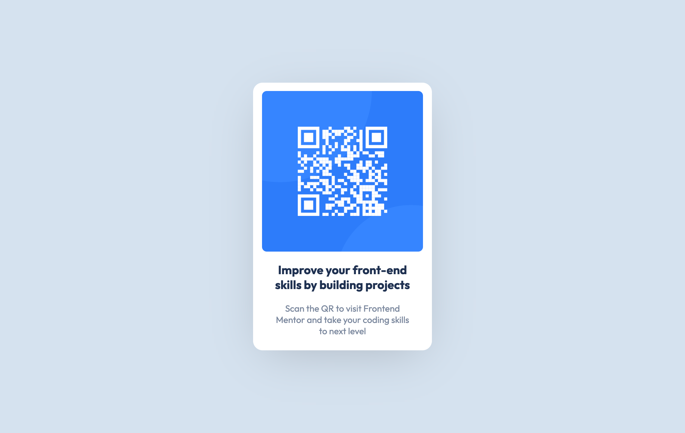

# Frontend Mentor - QR code component solution

This is a solution to the [QR code component challenge on Frontend Mentor](https://www.frontendmentor.io/challenges/qr-code-component-iux_sIO_H). Frontend Mentor challenges help you improve your coding skills by building realistic projects.

## Table of contents

- [Overview](#overview)
  - [Screenshot](#screenshot)
  - [Links](#links)
- [My process](#my-process)
  - [Built with](#built-with)
  - [Useful resources](#useful-resources)
- [Author](#author)

**Note: Delete this note and update the table of contents based on what sections you keep.**

## Overview

### Screenshot

### Links

- Solution URL: [here](https://github.com/vinayaksoni143/QR-code-component)
- Live Site URL: [here](https://qr-code-component-mu-cyan.vercel.app)

## My process

### Built with

- Semantic HTML5 markup
- CSS custom properties
- Flexbox
- Mobile-first workflow

### Useful resources

- [W3schools](https://www.example.com) - This helped me to learn css flexbox and image settings.

## Author

- Frontend Mentor - [@vinayaksoni143](https://www.frontendmentor.io/profile/vinayaksoni143)
- Twitter - [@vinayak_soni43](https://twitter.com/vinayak_soni43)
